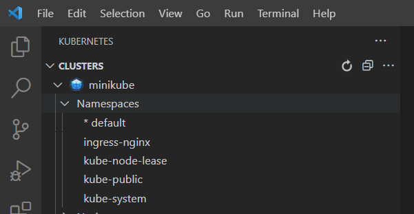
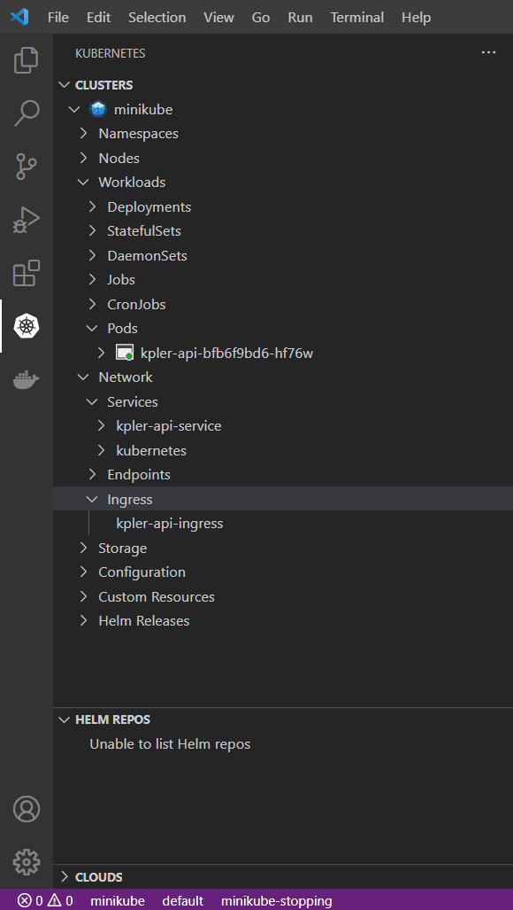

Simple API deployed on a minikube cluster
==============

***Kpler technical test***

**Author:** *Adrien Fuss*

# Introduction
This project is a simple API based on a Flask application (python framework). 
A docker image and helm chart is provided to deploy our flask API on a minikube cluster.

This helm chart defines a deployment, service, and ingress for a Flask application.
The Flask application is assumed to be serving on port 5000.

# Used tools
Several tools need to be installed and used :
- Python (version = 3.9) and libraries defined in requirements.txt installed or "pip install flask"
- kubernetes-cli (version = 1.22.2) installed with package manager chocolatey
- Minikube (version = 1.23.2) installed with package manager chocolatey
- Helm (version = 3.0.0)
- Docker Desktop
- IntelliJ IDE and project SDK using python 3.9 virtual environment
- Visual Code and Kubernetes extension
- Git and my [Github repository](https://github.com/adrien7466/kpler.git)  

# Repository content
Repository contains :
1. Flask application code with app.py file (Root endpoint definition)
2. Dockerfile to build our application image
3. Helm folder with our helm chart defining a deployment, a service, and an ingress

# Steps to reproduce the app build

## Run Flask application
Launch your application in a terminal inside folder project :
```bash
python -m flask run
```
Reach [this url](http://localhost:5000/) in your browser and check the root endpoint is displaying "Hello world"


## Check your dockerfile by building your docker image
Build your local image in a terminal and check if your local image has been created :
```bash
docker build --tag kpler/api:v1.0.0 .
docker images kpler/api
```

## Launch your minikube cluster
Download minikube and create a Minikube cluster :
```bash
minikube start
```

Once your cluster is ready, you can use the **default** namespace. 



## Reuse the Docker daemon
When using a single VM of kubernetes it's really handy to reuse the Docker daemon inside the VM;
As this means you don't have to build on your host machine and push the image into a docker registry
You can just build inside the same docker daemon as minikube which speeds up local experiments.

To be able to work with the docker daemon on your mac/linux host use the docker-env command in your bash terminal :
```bash
eval $(minikube docker-env)
```
You should now be able to use docker on the command line on your host mac/linux machine talking to the docker daemon inside the minikube VM:
Build the image with the Docker daemon of Minikube : 
```bash
docker build --tag kpler/api:v1.0.0 ./
```

You can check if image is present in minikube console
```bash
minikube ssh
docker images
```


## Deployments steps
Find below several steps to deploy our flask application on a minikube cluster.   

## Deployment template and image definition
Image in the pod spec is defined like the build tag : kpler/api:v1.0.0 
Moreover imagePullPolicy is defined to Never, otherwise Kubernetes will try to download the image.

## Set up Minikube Cluster with the NGINX Ingress Controller
Enable the Ingress controller :
```bash
minikube addons enable ingress
```

Verify that the NGINX Ingress controller is running
```bash
kubectl get pods -n ingress-nginx
```

## Helm upgrade
To install charts into Kubernetes (creating a new release), helm upgrade command is used :
```bash
helm upgrade --install kpler-api ./helm --namespace default --history-max 1
```
At this time, deployment / service / ingress are defined in our minikube cluster.


## Sending requests from DNS to Minikube
Request has to be sent from our DNS to Minikube. 

We recover the IP address by checking our ingress properties :
```bash
kubectl get ingress
```

Output :
```
NAME                CLASS   HOSTS           ADDRESS        PORTS   AGE
kpler-api-ingress   nginx   dev.kpler.com   192.168.49.2   80      2m25s
```

Log into the minikube environment :
```bash
minikube ssh
```

Add the following line to the bottom of the /etc/hosts file (with the corresponding internal IP) :
```bash
echo "192.168.49.2 dev.kpler.com" | sudo tee -a /etc/hosts
```
This will send requests from dev.kpler.com to Minikube.

Verify that the Ingress controller is directing traffic:
```bash
curl dev.kpler.com
```
Output:
```bash
Hello world
```

Your flask application is now working on your minikube cluster !


